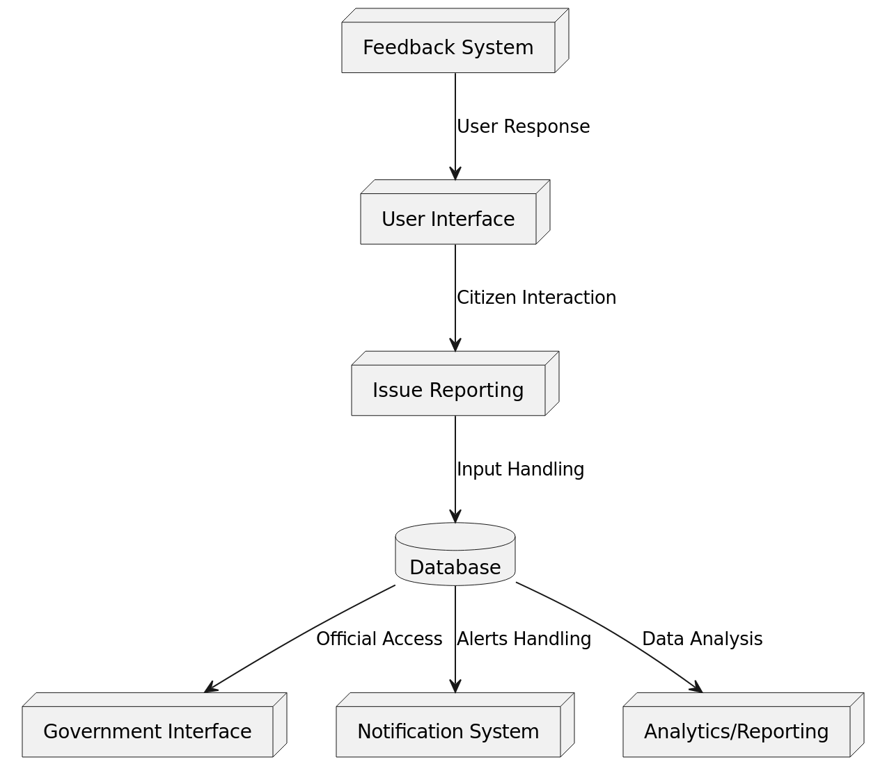
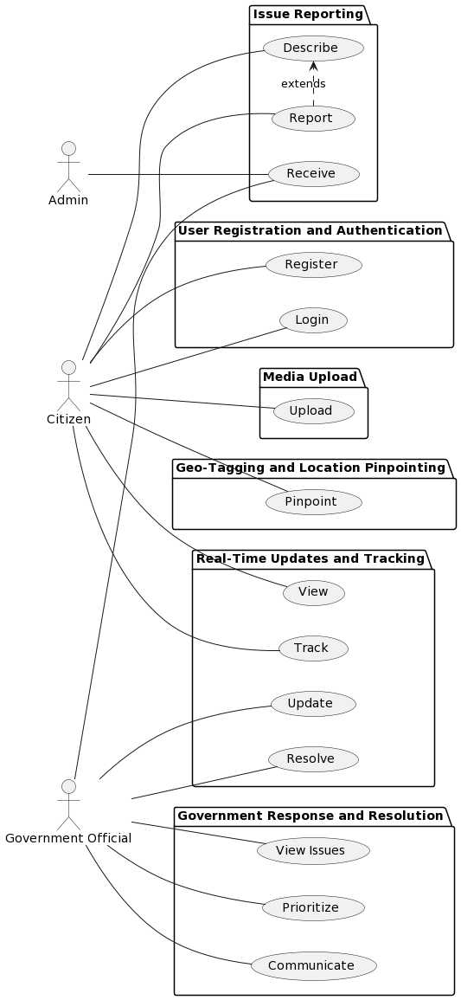
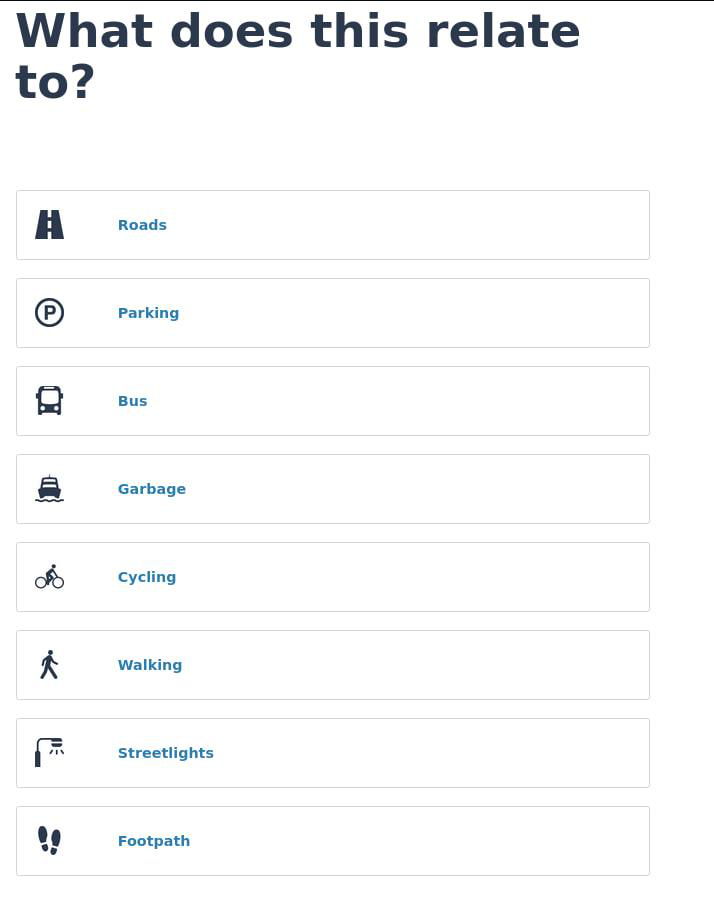
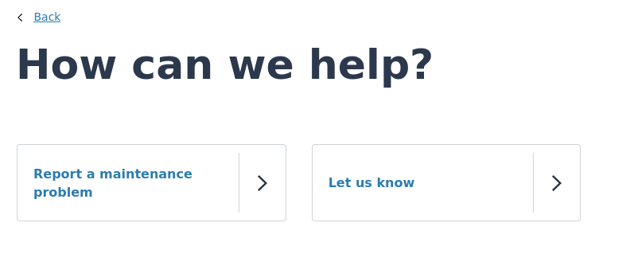
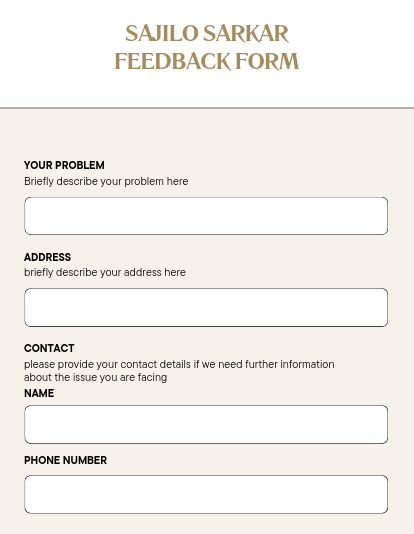
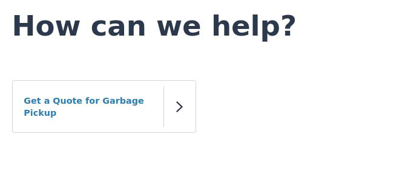
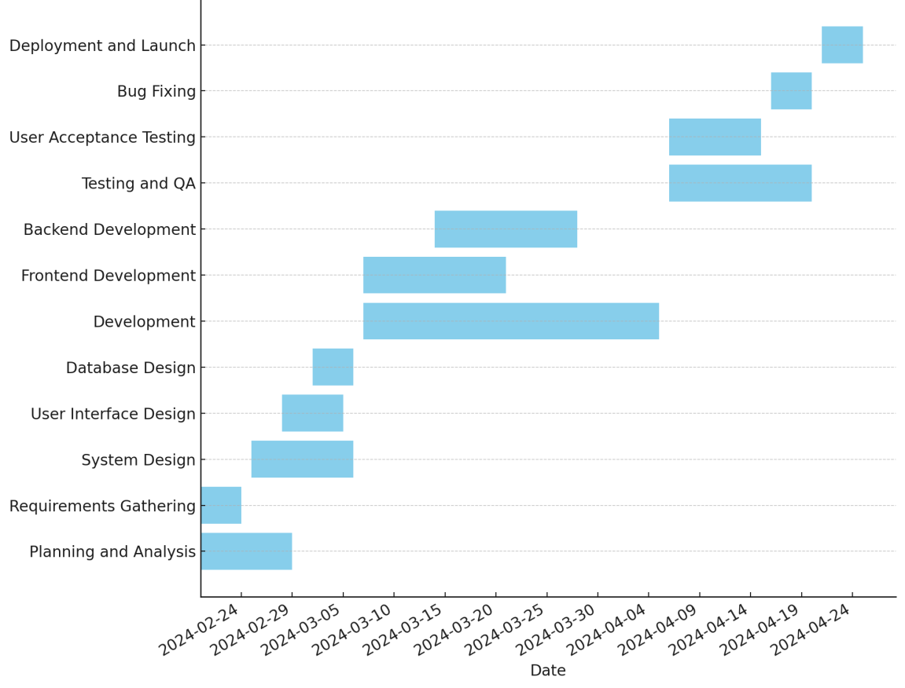

**ABSTRACT**\
\"***Sajilo Sarkar***\" is envisioned as a transformative project aimed
at enhancing the interaction between the government and its citizens,
particularly in addressing infrastructure issues like potholes. In many
instances, citizens find it challenging to report such issues due to the
complex and time-consuming procedures involved. This project seeks to
streamline this process by introducing an innovative *web portal*, which
acts as a bridge facilitating seamless communication between the
government and the public.

The primary goal of \"*Sajilo Sarkar*\" is to simplify and expedite the
process of reporting and addressing *civic* issues, making it more
efficient and less cumbersome for everyone involved. Currently, the
procedure to register a complaint or report an issue often involves
multiple steps, including filling out extensive paperwork, making
numerous phone calls, or even visiting government offices in person.
This not only demands a significant investment of time and effort from
the citizens but also often leads to delays in resolving the issues due
to *bureaucratic* inefficiencies.

The proposed *web portal*, central to the \"*Sajilo Sarkar*\" project,
is designed to be *user-friendly* and accessible to all citizens,
regardless of their technological expertise. Through this portal,
individuals can easily report problems such as potholes, broken
streetlights, or other *public infrastructure concerns* with just a few
clicks. The portal would guide users through a simple *reporting*
process where they can describe the issue, upload relevant photos, and
even pinpoint the exact location using integrated map features.

**Keywords: *Sajilo Sarkar, Infrastructure Concerns, Reporting, Web
Portal, User-Friendly, Civic, Public Infrastructure, Bureaucratic. ***

**1. Introduction**

**1.1 Overview**\
\"Sajilo Sarkar\" is a project designed to improve how the government
addresses various issues and handles small but important tasks. It aims
to create a direct line of communication and feedback between the
government and its citizens. Through this project, people can easily
report their concerns and issues to the government using a simple
system. This approach not only makes it easier for citizens to voice
their concerns but also helps the government in understanding and
addressing these issues more effectively.\[1\]

 The main goal of \"Sajilo Sarkar\" is to enhance the government\'s
 operations by incorporating feedback from the community. It\'s a
 system that works at both local and national levels, making it
 versatile and wide-reaching. By empowering citizens to share their
 insights and concerns, the project encourages a collaborative effort
 to improve government services. \[2\] This participatory approach
 ensures that the government remains responsive to the needs of its
 people, leading to better governance and community satisfaction.

**1.2 Objective**

 The long term goal of this project is to develop an platform which can
 bring both government and citizens together to develop locality and
 higher levels.\[2\]\
 It will helps in identifying, classifying, modeling, and resolving
 problems one by one. Particularly , the project emphasis the following
 objectives:

 i\. To address the issues and problems of government.

 ii\. To help for easy interaction of G-C-C
 policy(Government-Citizen-Community). iii. To compare the
 effectiveness of present and recent government.

 iv\. To give 24/7 facility to convey message to respective department

**1.3 Statement of problems**\
Government has always been trying to improve it\'s functionality and
works.They have initiated many complain desks to address the problem of
general public.\[2\] But they are not operating properly as desired.
Problems may have been raised due to following reasons.\[1\]

 i\. They may not be properly accessible to everyone.

 ii\. They are not available 24/7.

 iii\. Their is an long hectic procedures to register problems.

 iv\. Reported issues may not reach the respective department.

1

**1.4 Block diagram**

 

*Figure 1 : block diagram of sajio sarkar* \[5\]

2

**2. Project Functional and Non-Functional Requirement**

 **2.1 Functional Requirements:**\
 **1.User Registration and Authentication:**\
 •Users should be able to register on the web portal securely.

 •The system must authenticate users to ensure the security and
 integrity of the reporting process.

 **2.Issue Reporting:**\
 •Users should be able to report civic issues such as potholes, broken
 streetlights, etc.

 •The reporting process should be simple and intuitive, guiding users
 through the necessary steps.

 **3.Media Upload:**\
 •The system must allow users to upload photos or videos related to the
 reported issues for better understanding by government officials.

 **4.Geo tagging and Location Pinpointing:**\
 •Users should be able to pinpoint the exact location of the reported
 issue using integrated map features.

 •The system must accurately capture and store the geo-location data
 associated with each report.

 **5.Real-Time Updates and Tracking:**\
 •Users should receive real-time updates on the status of their
 reported issues.

 •The system must provide a mechanism for users to track the progress
 of their complaints.

 **6.Government Response and Resolution:**\
 •Government officials should have access to reported issues and be
 able to prioritize and address them efficiently.

 •The system should facilitate communication between citizens and
 government authorities regarding issue resolution.

3

 

*Figure 2 : UseCase Diagram of Sajilo Sarkar* **\[4\]**

4

**2.2 Non-Functional Requirements:**\
**1.Usability:**\
•The web portal must have a user-friendly interface, catering to users
with varying levels of technological expertise.

 •It should be intuitive and easy to navigate, ensuring a seamless user
 experience.

 **2.Performance:**\
 •The system should be able to handle a large volume of user requests
 and reports without significant latency.

 •Response times for user interactions, such as submitting reports or
 tracking issues, should be minimal.

 **3.Security:**\
 •The portal must implement robust security measures to protect user
 data and prevent unauthorized access.

 •Data encryption, secure authentication mechanisms, and access
 controls should be in place to ensure confidentiality and integrity.

 **4.Reliability:**\
 •The system should be highly available and reliable, with minimal
 downtime or service interruptions. •It should be resilient to failures
 and capable of recovering gracefully in case of unexpected events.

 **5.Scalability:**\
 •The architecture should be scalable to accommodate future growth in
 user numbers and data volume.

 •It should be able to handle increased demand without degradation in
 performance or reliability.

 **6.Accessibility:**\
 •The web portal should adhere to accessibility standards, ensuring
 that it is usable by individuals with disabilities.

 •Features such as screen reader compatibility and keyboard navigation
 should be implemented to support accessibility requirements.

5

**3. Expected Output** \[3\]

*Figure 3 : Main reporting page*

6

 

*Figure 4 : Further information page*

 

*Figure 5 : Information submitting page*

7

 

 *Figure 6 : Quoting and payment page for Garbage related issue*

8

**4. Project Timeline**

 
*Figure 7 : Gantt Chart of Sajilo Sarkar*

 **1.Planning and Analysis (Approx. 3 days):** This initial phase is
 crucial for setting the project\'s foundation. It involves
 understanding project requirements and analyzing the necessary
 resources. It appears to begin the project and lasts for a short
 duration, suggesting a high-level planning approach.

 **2.Requirements Gathering (Approx. 5 days):** Following planning, the
 team will spend about 5 days gathering detailed requirements, which is
 essential for defining the project\'s scope.

 **3.System Design (Approx. 4 days):** Once the requirements are clear,
 the system design phase kicks off. In this phase, which lasts
 approximately 4 days, the project\'s architecture and design
 specifications are created.

 **4.User Interface Design (Approx. 4 days):** Running concurrently
 with System Design for about 4 days, this phase focuses on designing
 the user interface, emphasizing the look and feel of the application.

 **5.Database Design (Approx. 6 days):** Starting shortly after the
 design phases and overlapping with Development, Database Design is
 scheduled for around 6 days. This indicates that the database design
 is being refined alongside initial development work.

 **6.Development (Approx. 10 days):** This broad category suggests the
 actual coding of the software. It spans around 10 days and partially
 overlaps with Frontend and Backend Development, hinting at a possible
 agile development approach where different components are built
 simultaneously.

9

 **7.Frontend Development (Approx. 8 days):** This task overlaps with
 Backend Development, indicating that both the client-side and
 server-side of the application are being worked on in tandem for about
 8 days.

 **8.Backend Development (Approx. 7 days):** Starting just before
 Frontend Development, this phase seems to focus on the server-side
 development for around 7 days.

 **9.Testing and QA (Approx. 6 days):** Quality Assurance and testing
 are scheduled to last about 6 days, starting before Backend
 Development ends, suggesting that some components are being tested
 while others are still in development.

 **10.User Acceptance Testing (Approx. 3 days):** After the initial
 testing phase, there\'s a shorter, focused period of about 3 days for
 User Acceptance Testing, where end-users validate the functionality of
 the software.

 **11.Bug Fixing (Approx. 5 days):** Near the end of the timeline,
 there\'s a 5-day period allocated for fixing any issues discovered
 during testing.

 **12.Deployment and Launch (Approx. 2 days):** The final phase is the
 deployment and launch, taking roughly 2 days. This is when the
 software goes live for users.

10

**5. References**

\[1\]\" Wikipedia,\" \[Online\]. Available:
https://en.wikipedia.org/wiki/E-government. \[2\]\" Federal Trade
Commission,\" \[Online\]. Available:

\[3\]\" MyAt,\" \[Online\]. Available: \[4\]\" UseCaseDiagram,\"
\[Online\].

\[5\]\" BlockDiagram,\" \[Online\]. Available: https://chatuml.com/.

11
